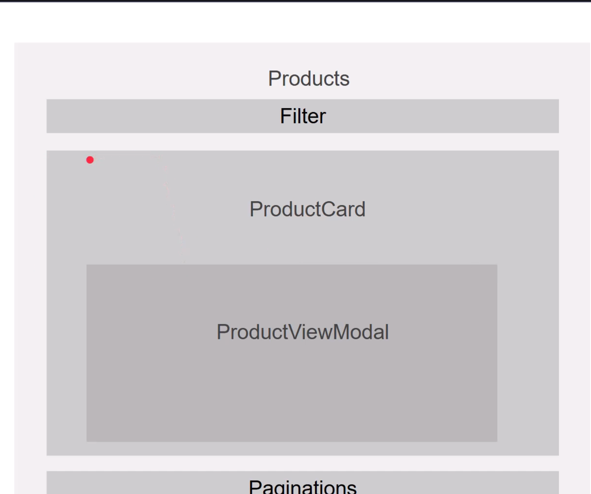
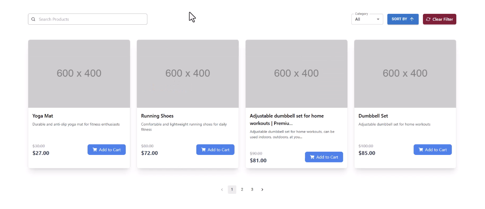

- [Front-end Setting](#front-end-setting)
    - [1. Initialize Vite Project](#1-initialize-vite-project)
    - [2. Install Dependencies](#2-install-dependencies)
    - [3. Run Development Server](#3-run-development-server)
    - [4. Tailwind CSS Setup](#4-tailwind-css-setup)
    - [5. Install Material UI](#5-install-material-ui)
    - [6. Install react-icon](#6-install-react-icon)
    - [7. Install react-hot-toast](#7-install-react-hot-toast)
- [StoreFront-Store Page](#storefront-store-page)
  - [Structure](#structure)
  - [demo image](#demo-image)
- [Referecne](#referecne)

# Front-end Setting

### 1. Initialize Vite Project

```bash
npm create vite@latest
```

- **Project Name:** `ecom-front`
- **Framework:** `React`
- **Variant:** `JavaScript`

### 2. Install Dependencies

```bash
npm install
```

### 3. Run Development Server

```bash
npm run dev
```

### 4. Tailwind CSS Setup

[Official Installation Guide](https://tailwindcss.com/docs/installation/using-vite)

- **Install Tailwind CSS & Vite Plugin:**
  ```bash
  npm install tailwindcss @tailwindcss/vite
  ```
- **Configure `vite.config.js`:** Add the Tailwind plugin to the configuration.
- **Import Tailwind CSS:** Add the following to your main CSS file:
  ```css
  @import "tailwindcss";
  ```
- **Restart Build Process:**
  ```bash
  npm run dev
  ```

### 5. Install Material UI

Install Material UI, the world's most popular React UI framework.

```bash
npm install @mui/material @emotion/react @emotion/styled
```

### 6. Install react-icon

```bash
npm install react-icons --save
```

### 7. Install react-hot-toast

```bash
npm install react-hot-toast
```

# StoreFront-Store Page

## Structure



## demo image



# Referecne

This project is based on the [EmbarkX Spring Boot Course](https://github.com/EmbarkXOfficial/spring-boot-course), which provides a professional eCommerce Project Masterclass using Java and Spring Boot.


